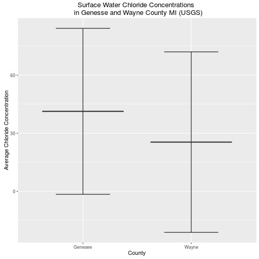
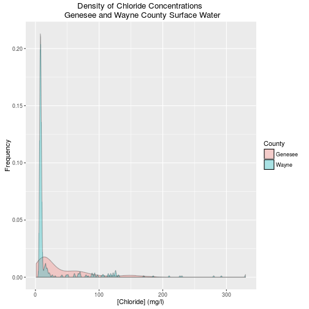

## An Analysis of the Flint Michigan Initial Surface Water Corrosivitiy
### Part 1: Start at the Source

###Introduction
As many have heard recently residents of Flint Michigan have been rightly outraged due to the high presence of toxic chemicals including lead in their drinking water. The question arises how did this occur and was it a forseeable incident? The backstory that led up to this incident can be generalized into a few main chapters.

1) Flint had long sourced their water from the Detroit Water and Sewerage Department (DWSD)
2) The city had financial incentive to reduce spending because they were under financial stress
3) Flint went into an agreement with the Karegnondi Water Authority (KWA) and their to be completed source from Lake Huron(end of 2016) 
4) The existing supplier DWSD provided their 12 month notice that their supply contract would end on April 2014
5) The flint river was relied on to supply water in the interim
6) The flint river contained significantly higher levels of chloride than the Detroit water source and no anti-corroding agents were applied

###Hypothesis

In this analysis we will utilize Census Data as well as US Geological Wate Quality Survey Data to analyse the Flint incident starting at the source pre-treated water as well as nearby streams in Detroit and near Lake Huron. It is not meant to serve as conclusive evidence of any kind. We will be looking specifically at chloride concentrations to see if Flint, Mi has very corrosive water to begin with.

Before we begin let's check for and install any necesary packages for this story

```r
setwd("~/DSTribune/Stories/FlintWaterQuality")
library(ggplot2)
library(dplyr)
```

```
## 
## Attaching package: 'dplyr'
```

```
## The following objects are masked from 'package:stats':
## 
##     filter, lag
```

```
## The following objects are masked from 'package:base':
## 
##     intersect, setdiff, setequal, union
```

```r
library(xtable)
```


The city of Flint is located in Genesee County and this is really a story of three counties. Detroit, Wayne County that originally sold treated water from [multiple rivers including the Detroit River](http://www.dwsd.org/downloads_n/customer_service/customer_information/water_quality_report.pdf) to Flint as well as the KWA plant [under construction sourcing water from Lake Huron] (http://www.nytimes.com/2014/05/26/business/detroit-plan-to-profit-on-water-looks-half-empty.html?_r=0) located in Sanilac County. 

We will download fresh water data from those two counties and merge them into one data frame

```r
#Genesee (Flint)
temp <- tempfile()
download.file("http://waterqualitydata.us/Result/search?countrycode=US&statecode=US%3A26&countycode=US%3A26%3A049&sampleMedia=Water&characteristicType=Inorganics%2C+Major%2C+Non-metals&characteristicName=Chloride&mimeType=csv&zip=yes&sorted=no", temp)
wqGen<- read.csv(unz(temp, "result.csv"))
wqGen$County = "Genesee"


#Wayne (Detroit River)

temp <- tempfile()
download.file("http://waterqualitydata.us/Result/search?countrycode=US&statecode=US%3A26&countycode=US%3A26%3A163&sampleMedia=Water&characteristicType=Inorganics%2C+Major%2C+Non-metals&characteristicName=Chloride&mimeType=csv&zip=yes&sorted=no", temp)
wqWayne<- read.csv(unz(temp, "result.csv"))
wqWayne$County = "Wayne"


#Merge the three County Water Measurements
wqDf <- rbind(wqGen, wqWayne)

#Save an offline version of the merged county water data
write.csv(wqDf, file ="MI3CountyCountyWaterData.csv")
```


We filtered our data for high quality measurements only taken at the surface. We specifically collected data on dissolved chloride concentrations because chloride ions are the key element in contributing to the corrosion in Flint pipes leading the leaching of metals such as lead. In the second half of this story we will also cover how the addition of chlorine escalated chloride concentrations but for now we will focus on pre-treatment water quality.


```r
wqDf <- filter(wqDf, ActivityMediaSubdivisionName == "Surface Water", ResultSampleFractionText == 'Dissolved', ResultStatusIdentifier == 'Accepted' | ResultStatusIdentifier == 'Final' | ResultStatusIdentifier == 'Historical')
wqDf$MonitoringLocationIdentifier <- as.character(wqDf$MonitoringLocationIdentifier)
wqDf$ActivityStartDate <- as.POSIXct(wqDf$ActivityStartDate)
wqDf <- wqDf %>%
  filter(ResultMeasureValue != "NA")
```


We now would like to see if there is a significant difference in pre-treated chloride concentrations amongst the two counties.

```r
#What we want is a percentage of samples binned by concentration
percentConc<- wqDf %>%
  group_by(County) %>%
  summarise(Avg = mean(ResultMeasureValue, na.rm = TRUE),
            Max = max(ResultMeasureValue, na.rm = TRUE),
            Median = median(ResultMeasureValue, na.rm = TRUE),
            LatestSample = max(ActivityStartDate, na.rm = TRUE),
            totalSamples = n(),
            stdError = sd(ResultMeasureValue, na.rm = TRUE))

percentConc$min <- percentConc$Avg - percentConc$stdError
percentConc$max <- percentConc$Avg + percentConc$stdError
       
plot1 <- ggplot(percentConc, aes(x=County)) 
plot1 <- plot1 + geom_errorbar(aes(ymin=min,ymax=max),data=percentConc,width = 0.5)
plot1 <- plot1 + geom_boxplot(aes(y=Avg))
plot1 <- plot1 + ggtitle("Surface Water Chloride Concentrations \n in Genesse and Wayne County MI (USGS)") + ylab("Average Chloride Concentration")
plot1
```



What we care about in this plot is the average as well as the standard error of the distribution. On first glance it appears that Genesee County overall has a higher concentration of chloride in the surface water overall. Let's see if this is statistically significant or not as their is overlap in the standard error.

```r
Gen <- filter(wqDf, County == "Genesee")
Way <- filter(wqDf, County == "Wayne")
Gen_Way <- t.test(Gen$ResultMeasureValue, Way$ResultMeasureValue, alternative=c("greater"))
Gen_Way$p.value
```

```
## [1] 1.04371e-05
```
The p-value for this t-test shows that Genesee County has a significantly greater chloride conncentration in its surface water compared to Dwayne county. Remember Dwanye county houses the Detroit River AKA the old reliable and expensive source of water that Flint was sourcing its water from originally before switching.


```
## Warning in formatC(x = structure(c(1446015600, 1019113200), class =
## c("POSIXct", : class of 'x' was discarded
```

<!-- html table generated in R 3.1.2 by xtable 1.8-2 package -->
<!-- Tue Mar  1 18:40:56 2016 -->
<table border=1>
<tr> <th>  </th> <th> County </th> <th> Avg </th> <th> Max </th> <th> Median </th> <th> LatestSample </th> <th> totalSamples </th> <th> stdError </th> <th> min </th> <th> max </th>  </tr>
  <tr> <td align="right"> 1 </td> <td> Genesee </td> <td align="right"> 41.31 </td> <td align="right"> 185.00 </td> <td align="right"> 21.00 </td> <td align="right"> 1446015600.00 </td> <td align="right"> 229 </td> <td align="right"> 42.88 </td> <td align="right"> -1.57 </td> <td align="right"> 84.19 </td> </tr>
  <tr> <td align="right"> 2 </td> <td> Wayne </td> <td align="right"> 25.41 </td> <td align="right"> 330.00 </td> <td align="right"> 8.50 </td> <td align="right"> 1019113200.00 </td> <td align="right"> 383 </td> <td align="right"> 46.62 </td> <td align="right"> -21.22 </td> <td align="right"> 72.03 </td> </tr>
   </table>

Surface Water samples taken in the County of Genesee appear to show a multi-decade historical average of 41.3 mg/l almost twice as much as the 25.4 mg/l average in Genesee County. At this point I got a funny feeling why not check the median it should be relatively close to the mean?


```r
tapply(wqDf$ResultMeasureValue, wqDf$County, median)
```

```
## Genesee   Wayne 
##    21.0     8.5
```

Turns out the median was nowhere near the mean. The median shows Genesee County having a chloride concentration of 21.0 mg/l and Wayne with a 8.5 mg/l concentration. Genesee County has almost 3X the pre-treatment or initial chloride concentration compared to Wayne county. The discrepancy between the median and mean could be outliers or a non-normal distribution. If my experience has taught me any thing in these circumstances I need to see the full distribution and see what is happening here.


```r
ggplot(wqDf, aes(x = ResultMeasureValue, fill = County)) + geom_density(alpha = 0.3) + ggtitle("Density of Chloride Concentrations \n Genesee and Wayne County Surface Water") + xlab("[Chloride] (mg/l)") + ylab("Frequency")
```


That distribution sure doesn't look normal. It appears Wayne county has a lot of samples with low concentrations of chloride. It could be that one sampling site has so many samples that it is warping the mean and median. Perhaps what we should be doing is collecting an average by sample site and looking at the distribution of sample site averages.


```r
percentConc<- wqDf %>%
  group_by(MonitoringLocationIdentifier, County) %>%
  summarise(Avg = mean(ResultMeasureValue, na.rm = TRUE),
            Max = max(ResultMeasureValue, na.rm = TRUE),
            Median = median(ResultMeasureValue, na.rm = TRUE),
            LatestSample = max(ActivityStartDate, na.rm = TRUE),
            totalSamples = n(),
            stdError = sd(ResultMeasureValue, na.rm = TRUE))

tapply(percentConc$Median, percentConc$County, mean)
```

```
##  Genesee    Wayne 
##  33.2125 115.5000
```
This just got interesting. At first it appeared as though Genesee County had significantly higher concentrations of Chloride than Wayne County. However once we aggregated median concentrations by Site and then averaged those by County It appears that Wayne County has 5X the amount of chloride in its surface water. To put this to rest we will conduct one more filter to remove sites with less than 3 samples to remove outlier measurements at unique sites. Remember running even one water sample requires multiple labs, USGS employees sampling at a site, and tens of thousands of dollars. So 3 samples is a big deal in this world (I should know I used to sample and analyze water for 4 years for the US Geological Survey)


```r
HighSampleSizePercentConc <- filter(percentConc, totalSamples >= 3)
tapply(percentConc$Median, percentConc$County, mean)
```

```
##  Genesee    Wayne 
##  33.2125 115.5000
```

##Conclusion 

We have finally arrived closer to the truth. In general the rivers and lakes in Genesee County appear to have a much lower chloride concentration than those in Wayne County. 
We originally thought initial chloride concentrations would be high in addition to any chloride ions produced from the additional chlorine added to kill bacteria however this does not appear to be the case. It should be noted that Detroit also sourced its water from Lake Huron. This analysis also looked at bacterial measurements but found Flint, MI did not have enough samples taken from the USGS to warrant a similar analysis on bacteria concentrations. The lack of initial high corrosivity in the rivers relative to nearby counties as seen in the interactive map suggests that initial chloride concentrations may not have been the main contributor to corrosivity and instead the addition of chlorine to remove bacteria may have been the main contributor to the water corrosivity. 
